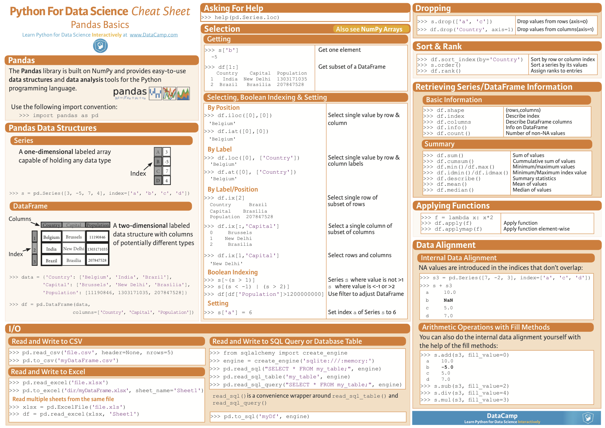
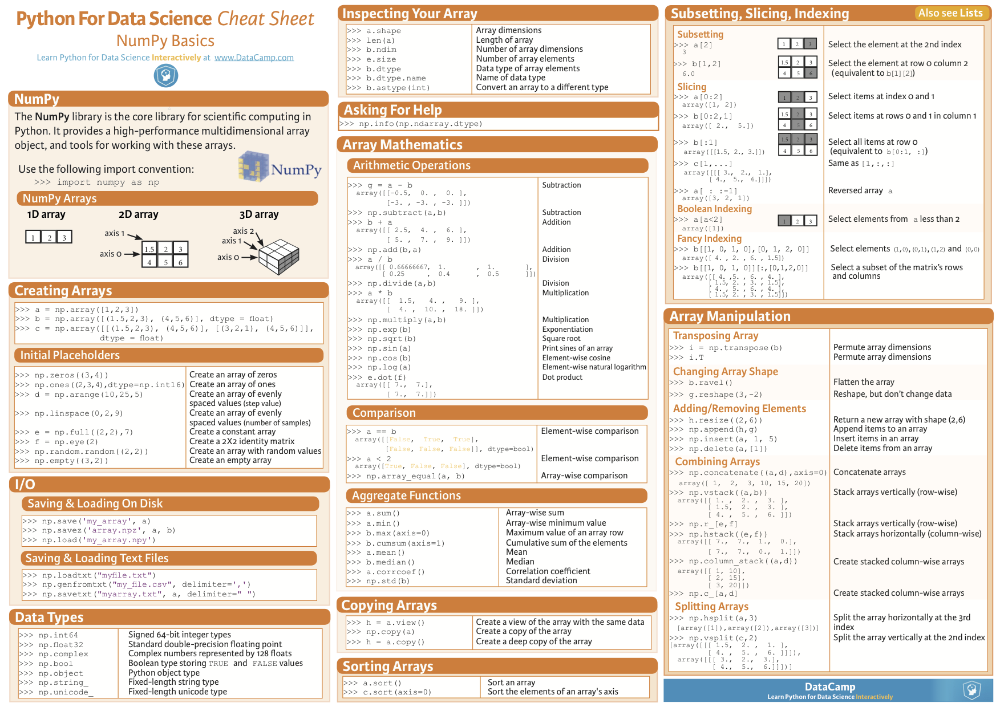
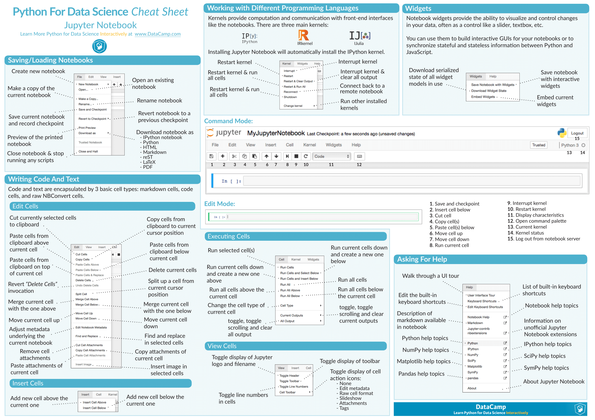
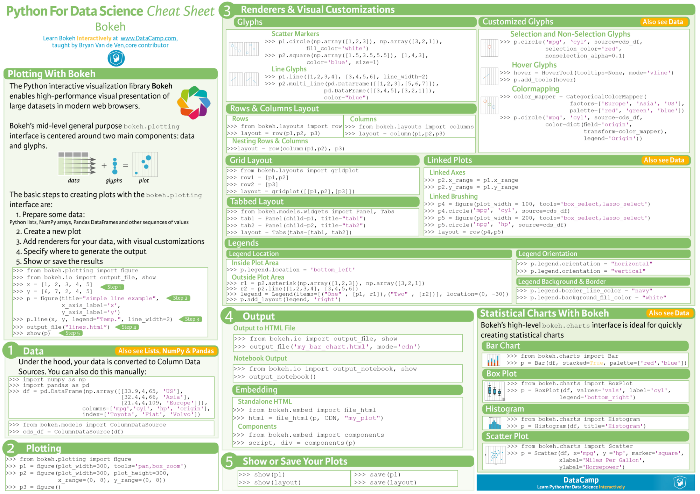
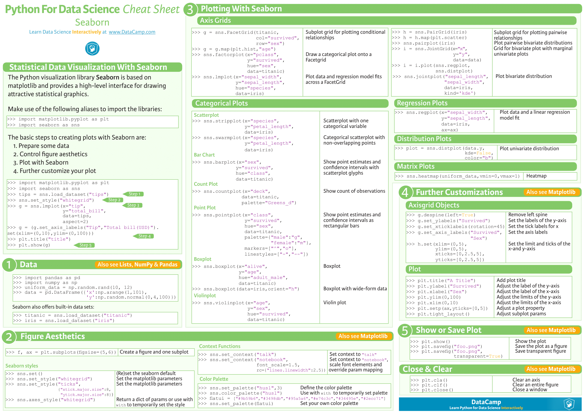
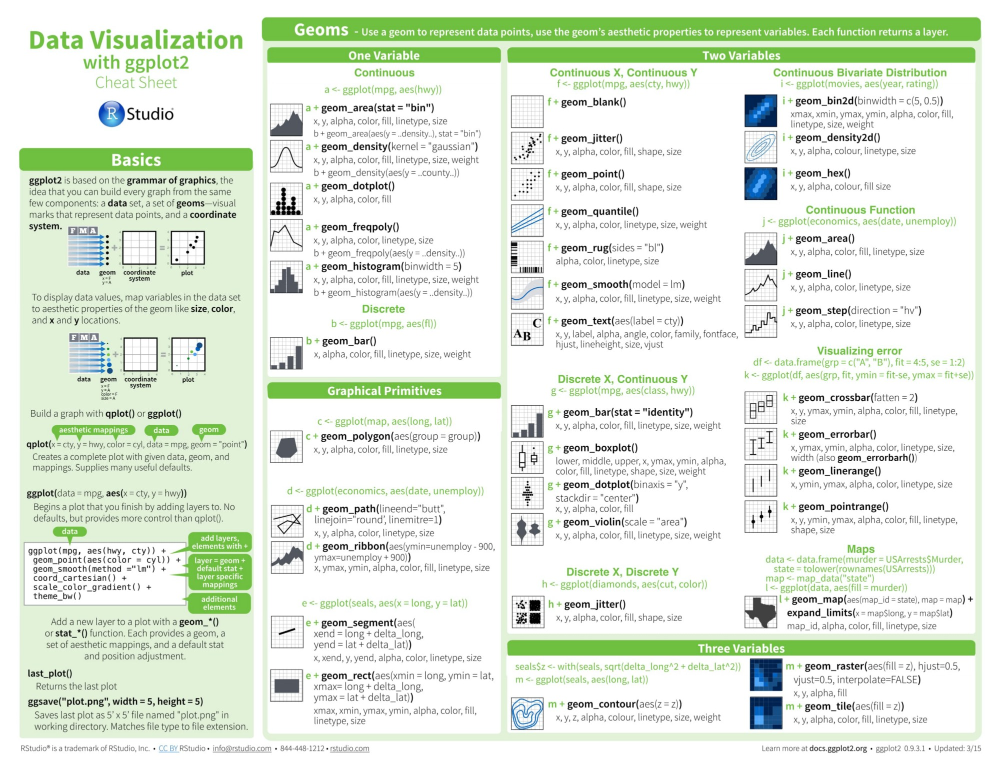
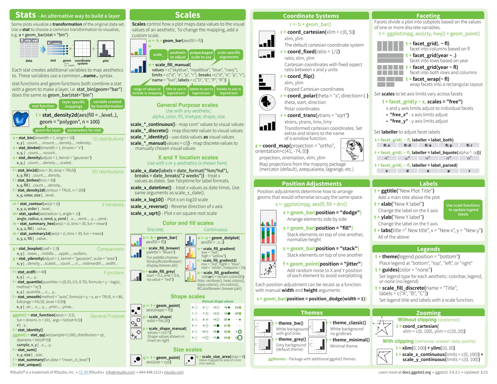

# Cheat Sheets recopilation

* Python
<ul> 
        <li><a href="#orgheadline1">Python for Data Science</a></li>
        <li><a href="#orgheadline2">Pandas</a></li>
        <li><a href="#orgheadline3">Numpy</a></li>
        <li><a href="#orgheadline4">Jupyter</a></li>
        <li><a href="#orgheadline5">Importing Data</a></li>             
        <li><a href="#orgheadline6">SciPy Linear Algebra</a></li>     
</ul>

* Visualization
<ul> 
        <li><a href="#orgheadline7">Bokeh</a></li>
        <li><a href="#orgheadline8">Matplotlib</a></li>
        <li><a href="#orgheadline9">Seaborn</a></li>  
        <li><a href="#orgheadline10">ggplot2</a></li>
</ul>

* Machine Learning
<ul> 
        <li><a href="#orgheadline11">Algorithm scikit</a></li>
        <li><a href="#orgheadline12">Scikit</a></li>
        <li><a href="#orgheadline13">Overview</a></li>  
        <li><a href="#orgheadline14">ML Azure</a></li>
</ul>

    
* Deep Learning
<ul> 
        <li><a href="#orgheadline15">Neural Networks</a></li>
        <li><a href="#orgheadline16">Neural Networks Graphs</a></li>
        <li><a href="#orgheadline17">Tensor Flow </a></li>  
        <li><a href="#orgheadline18">Keras</a></li>
</ul>

* Big Data
<ul> 
        <li><a href="#orgheadline19">PySpark</a></li>
</ul>

## Python

### Python for Data Science 

### Pandas 

### Numpy 

### Jupyter

### Importing Data 

### Scipy Linear Algebra 

## Visualization 

### Bokeh 

### Matplotlib

### Seaborn

### ggplot2 

## Machine Learning 

### Algorithm SciKit 

### Scikit-Learn 

### Overview

### ML Azure 

## Deep Learning 

### Neural Networks  

### Neural Networks Graphs 

### Tensor Flow

### Keras 

## Big Data

### PySpark  

